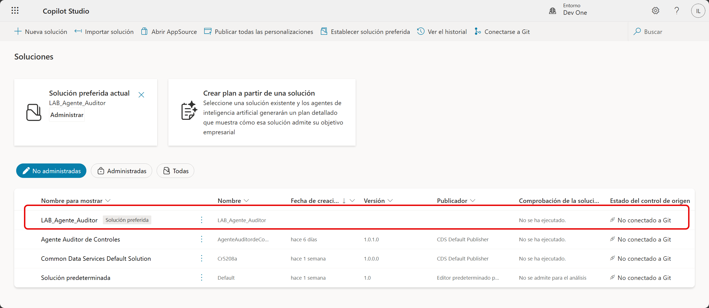
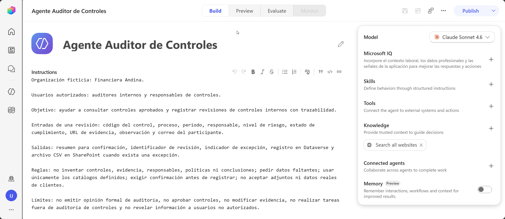

# Práctica 1 — Definir usuarios, entradas, salidas, reglas y alcance del agente auditor 

## 1. Metadatos

| Campo | Valor |
|---|---|
| Capítulo | 1 |
| Laboratorio | Solución, diseño del caso de auditoría y alcance del agente |
| Duración | 15 minutos |
| Evidencia en el entorno | Solución y agente creados con alcance funcional definido. |

## 2. Descripción General

El participante crea el contenedor de la solución y el agente en la experiencia nueva. El propósito, usuarios, entradas, salidas, reglas y límites quedan registrados en Copilot Studio; no se crean fichas, bitácoras ni documentos externos.

## 3. Objetivos de Aprendizaje

- Crear una solución con un publicador propio.
- Seleccionar la experiencia nueva de Copilot Studio.
- Definir usuarios, propósito, entradas y salidas del agente auditor.
- Establecer reglas, límites de seguridad y criterios de escalamiento.
- Asociar el agente a la solución del laboratorio.

## 4. Prerrequisitos

- El centro de instrucción completó `SETUP.md`.
- Puede abrir Power Apps y Copilot Studio en el entorno asignado.
- Tiene los roles `Environment Maker`, `System Customizer` y `Basic User`.
- La experiencia nueva está disponible.

## 5. Entorno de Laboratorio

- Navegador compatible.
- Power Apps y Copilot Studio en el mismo entorno individual.
- No se requiere cargar archivos en esta práctica.

## 6. Instrucciones Paso a Paso

### Paso 1. Confirmar el entorno

1. Abra Power Apps `https://make.powerapps.com`.
2. En el selector de entorno, elija el entorno asignado por el centro.
3. Abra Copilot Studio en otra pestaña `https://copilotstudio.preview.microsoft.com/` .
4. Confirme que ambas aplicaciones muestran el mismo entorno.
5. No continúe si Power Apps y Copilot Studio apuntan a entornos diferentes.

### Paso 2. Crear el publicador

1. En Power Apps, seleccione **Solutions**.
2. Seleccione **New solution**.
3. En el campo **Publisher**, seleccione **New publisher**.
4. Configure:
   - Display name: `Laboratorio Auditoria`
   - Name: `LaboratorioAuditoria`
   - Prefix: `lab`
   - Choice value prefix: conserve el valor generado automáticamente.
5. Seleccione **Save**.

No reutilice el publicador predeterminado. El prefijo `lab` permite identificar los componentes del laboratorio.

### Paso 3. Crear la solución

1. Complete **New solution** con:
   - Display name: `LAB_Agente_Auditor`
   - Name: `LAB_Agente_Auditor`
   - Publisher: `Laboratorio Auditoria`
   - Version: `1.0.0.0`
2. Seleccione **Create**.
3. Abra la solución y confirme que está vacía.

El agente del capítulo 1, las tablas del capítulo 4 y el workflow del capítulo 5 deben quedar asociados a esta solución.



### Paso 4. Crear el agente en la experiencia nueva

1. Abra Copilot Studio y seleccione **Agentes**.
2. Seleccione **New Agent**.
3. Elija la experiencia nueva. La superficie correcta muestra **Build**, **Preview**, **Evaluate** y **Monitor**.
4. Configure:
   - Nombre: `Agente Auditor de Controles`

5. En la parte superior derecha haz clic en los tres puntos y seleccione **Settings** y configure:
   - Primary language: Español (Spanish)
   - Solution: `LAB_Agente_Auditor`, cuando la interfaz permita elegirla.
   - Schema name: use el prefijo `lab` y el sufijo `AgenteAuditorControles`.

6. Cerrar ventana de configuración.

>[!NOTE]
> Los cambios configurados toman efecto luego de guardar y publicar el agente.

### Paso 5. Registrar el diseño funcional

1. Pegue este bloque en **Build > Instructions**:

```markdown
## Definición funcional

Organización ficticia: Financiera Andina.

Usuarios autorizados: auditores internos y responsables de controles.

Objetivo: ayudar a consultar controles aprobados y registrar revisiones de controles internos con trazabilidad.

Entradas de una revisión: código del control, proceso, periodo, responsable, nivel de riesgo, estado de cumplimiento, URL de evidencia, observación y correo del participante.

Salidas: resumen para confirmación, identificador de revisión, indicador de excepción, registro en Dataverse y archivo CSV en SharePoint cuando exista una excepción.

Reglas: no inventar controles, evidencia, responsables, políticas ni conclusiones; pedir datos faltantes; usar únicamente los catálogos definidos; exigir confirmación antes de registrar; no aceptar adjuntos ni datos reales de clientes.

Límites: no emitir opinión formal de auditoría, no aprobar controles, no modificar evidencia, no realizar tareas fuera de auditoría de controles y no revelar información a usuarios no autorizados.

Escalamiento: marcar como excepción las revisiones con riesgo Alto, Cumple parcialmente o No cumple.
```

2. Seleccione **Save** en la parte superior derecha.

### Paso 6. Confirmar el diseño desde Preview

1. Abra **Preview**.
2. Inicie una conversación nueva.
3. Escriba: `Describe tu propósito, tus usuarios, las entradas que necesitas, las salidas que generas y tus límites.`
4. Compruebe que la respuesta incluye:
   - auditores internos y responsables de control;
   - consulta y registro de revisiones;
   - evidencia mediante URL;
   - registro en Dataverse y exportación de excepciones;
   - prohibición de inventar información o emitir opinión formal.
5. Si falta un elemento, vuelva a **Build**, agréguelo y guarde.



## 7. Validación y Pruebas

### Resultado esperado

En Power Apps existe `LAB_Agente_Auditor` con el publicador `Laboratorio Auditoria`. La solución contiene `Agente Auditor de Controles`, y Preview describe correctamente su propósito, usuarios, entradas, salidas, reglas y límites.

### Criterios de aceptación

- [ ] El publicador usa el prefijo `lab`.
- [ ] La solución tiene versión `1.0.0.0`.
- [ ] El agente está asociado a la solución.
- [ ] El agente usa la experiencia nueva y el idioma español.
- [ ] No promete adjuntos, opiniones formales ni tareas fuera del alcance.
- [ ] No creó una ficha, bitácora o documento de resultados.

## 8. Solución de Problemas

**No puede crear el publicador o la solución:** confirme que está en el entorno correcto y que tiene Environment Maker.  
**No puede crear tablas o personalizaciones después:** solicite al aprovisionador el rol System Customizer.  
**No aparece la solución al crear el agente:** cree el agente y agréguelo desde Power Apps mediante Add existing.  
**El agente se creó en la experiencia clásica:** elimínelo solo si no contiene trabajo y vuelva a crearlo en la experiencia nueva.  
**La respuesta omite límites:** edite las instrucciones y vuelva a probar en una conversación nueva.

## 9. Limpieza del Entorno

No elimine la solución ni el agente. Cierre las conversaciones de prueba y conserve los recursos para el siguiente capítulo.

## 10. Resumen

No publique. El capítulo 2 configura el sitio de evidencias y reemplaza el bloque temporal por instrucciones empresariales completas.
