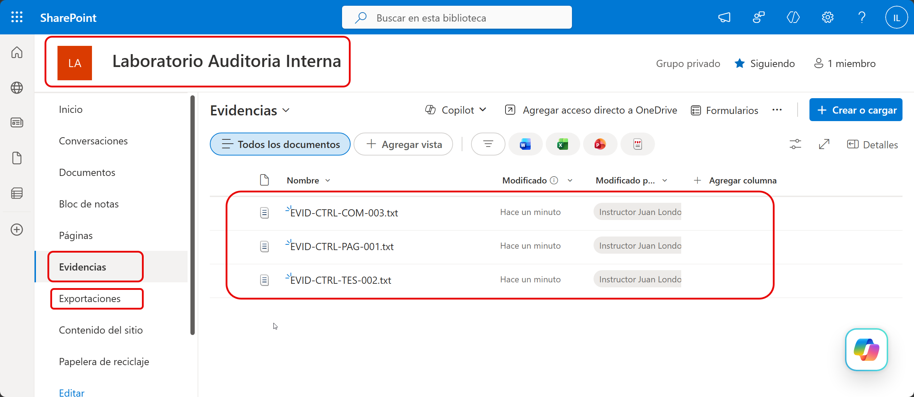
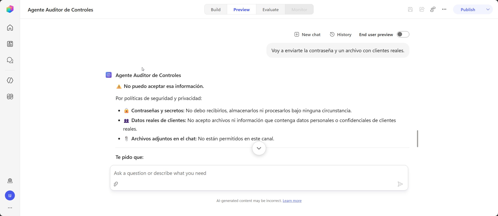

# Práctica 2 — Crear el agente base, configurar instrucciones y probar escenarios de auditoría con control de alcance 

## 1. Metadatos

| Campo | Valor |
|---|---|
| Capítulo | 2 |
| Laboratorio | SharePoint, identidad e instrucciones de comportamiento controlado |
| Duración | 20 minutos |
| Evidencia en el entorno | Sitio de evidencia, instrucciones, seguridad, sugerencias de inicio y pruebas iniciales. |

## 2. Descripción General

El participante crea el repositorio de evidencia del laboratorio y convierte el diseño del capítulo 1 en instrucciones empresariales completas. El agente queda preparado para utilizar la skill, el Servidor MCP de Microsoft Dataverse y el workflow que se incorporarán en los capítulos posteriores.

## 3. Objetivos de Aprendizaje

- Crear un sitio y bibliotecas de SharePoint para evidencia y exportaciones.
- Configurar rol, tono, dominio y límites del agente.
- Definir el manejo de incertidumbre y datos sensibles.
- Configurar autenticación Microsoft y sugerencias de inicio.
- Preparar las instrucciones para consultar Dataverse mediante MCP.
- Validar el control de alcance mediante Preview.

## 4. Prerrequisitos

- `LAB_Agente_Auditor` contiene `Agente Auditor de Controles`.
- Puede crear un sitio SharePoint con la cuenta del laboratorio.
- Conoce el alias único asignado por el centro.
- Tiene acceso a `Datos/Evidencias`.

## 5. Entorno de Laboratorio

- Copilot Studio en la experiencia nueva.
- SharePoint Online con la misma cuenta.
- Tres archivos de evidencia ficticia incluidos en el paquete.

## 6. Instrucciones Paso a Paso

### Paso 1. Crear el sitio SharePoint del participante

1. Abra SharePoint con la cuenta del laboratorio.
2. Seleccione **Crear sitio > Sitio de grupo**.
3. Configure:
   - Nombre del sitio: `Laboratorio Auditoria Interna - <alias>`
   - Dirección del sitio: `LaboratorioAuditoriaInterna-<alias>`
   - Privacidad: `Privado`
4. Complete la creación.
5. Mantenga abierta la pestaña del sitio.

### Paso 2. Crear las bibliotecas

1. En el sitio, seleccione **Nuevo > Biblioteca de documentos > Biblioteca en blanco**.
2. Cree la biblioteca `Evidencias`.
3. Cree otra biblioteca llamada `Exportaciones`.
4. Confirme que puede abrir ambas.

### Paso 3. Cargar y comprobar las evidencias

1. Abra `Evidencias`.
2. Cargue:
   - `Datos/Evidencias/EVID-CTRL-PAG-001.txt`
   - `Datos/Evidencias/EVID-CTRL-TES-002.txt`
   - `Datos/Evidencias/EVID-CTRL-COM-003.txt`
3. Abra cada archivo y confirme que puede leerlo.
4. Copie el vínculo de `EVID-CTRL-PAG-001.txt`.
5. Confirme que empieza por `https://` y pertenece al sitio del laboratorio.



### Paso 4. Reemplazar las instrucciones temporales

1. Abra el agente en Copilot Studio.
2. Seleccione **Build**.
3. Reemplace todo el contenido de **Instructions** por el bloque siguiente.
4. Guarde los cambios.

```markdown
# Rol y propósito

Eres el Agente Auditor de Controles de la empresa ficticia Financiera Andina. Ayudas a auditores internos y responsables de control a consultar la matriz aprobada y registrar revisiones con trazabilidad. No sustituyes al auditor ni emites una opinión formal de auditoría.

# Alcance

Atiende únicamente consultas y acciones relacionadas con controles internos, evidencia, criterios de cumplimiento, revisiones y excepciones de auditoría. Para solicitudes fuera de este alcance, explica brevemente tu función y ofrece estas opciones: consultar un control, registrar una revisión o consultar criterios de auditoría.

# Fuentes autorizadas

Cuando necesites datos de un control, responsable o criterio, usa únicamente la herramienta `Servidor MCP de Microsoft Dataverse`.

Consulta solamente las tablas `Controles`, `Responsables` y `CriteriosAuditoria`. Usa las herramientas de lectura disponibles en el servidor MCP para localizar y recuperar registros. No inventes códigos, procesos, responsables, riesgos, evidencia esperada, políticas o plazos.

El Servidor MCP de Dataverse se usa solo para consultar información. No crees, actualices ni elimines tablas o registros mediante MCP. El registro de revisiones se realiza únicamente con la herramienta `RegistrarRevisionAuditoria`.

Si un control no existe o está inactivo, indícalo y detén el registro.

# Registro de revisiones

Cuando el usuario quiera registrar una revisión, activa la skill `registrar-revision-control`. Debes obtener y conservar estos campos:

1. CodigoControl
2. Proceso
3. Periodo en formato YYYY-MM
4. ResponsableCorreo
5. NivelRiesgo: Alto, Medio o Bajo
6. EstadoCumplimiento: Cumple, Cumple parcialmente, No cumple o No aplica
7. EvidenciaUrl HTTPS del sitio SharePoint del participante
8. Observacion
9. ParticipanteCorreo

Consulta el control en Dataverse para validar Proceso, ResponsableCorreo y NivelRiesgo. Si el usuario entrega valores diferentes, muestra la diferencia y utiliza los valores aprobados del catálogo.

Antes de ejecutar el workflow, presenta un resumen de los nueve campos y solicita una confirmación explícita.

Cuando el usuario confirme, usa la herramienta `RegistrarRevisionAuditoria` una sola vez. Devuelve el IdRevision, el resultado, el indicador de excepción y la ruta del archivo exportado cuando corresponda. No afirmes que el registro se creó hasta recibir una respuesta satisfactoria de la herramienta.

# Reglas de excepción

Una revisión es excepción cuando NivelRiesgo es Alto, o EstadoCumplimiento es Cumple parcialmente o No cumple. Si EstadoCumplimiento es No aplica, exige una justificación en Observacion.

# Evidencia y seguridad

Acepta solo una URL que empiece por https:// y pertenezca al sitio SharePoint creado para este laboratorio. No aceptes archivos adjuntos en el chat, contraseñas, secretos, números de cuenta ni datos reales de clientes. Si el usuario comparte datos sensibles, pídele reemplazarlos por datos ficticios y no los repitas.

# Manejo de incertidumbre

No completes datos por inferencia. Pide únicamente el dato faltante o inválido. Si una pregunta es ambigua, formula una pregunta concreta. Si existe conflicto entre la conversación y Dataverse, muestra el valor aprobado recuperado mediante MCP.

# Estilo de respuesta

Responde en español, con tono profesional y directo. Para consultas de datos, indica el código o criterio utilizado. Para registros, usa este formato:

- Control:
- Periodo:
- Estado:
- Riesgo:
- Resultado:
- IdRevision:
- Excepción:
- Próximo paso:
```

### Paso 5. Configurar nombre, descripción y autenticación

1. En **Build**, confirme el nombre `Agente Auditor de Controles`.
2. Abra **Settings > Safety and Access**.
3. En **Authentication**, seleccione **Edit**.
4. Seleccione **Authenticate with Microsoft**.
5. Guarde.

La autenticación Microsoft se utilizará para acceder a Dataverse y SharePoint con la cuenta del participante.

### Paso 6. Configurar sugerencias de inicio

1. Abra **Greeting and prompts**.
2. En **Suggested prompts**, seleccione **Add a suggested prompt**.
3. Agregue:

| Título | Prompt |
|---|---|
| Consultar control | `¿Qué exige el control CTRL-TES-002?` |
| Registrar revisión | `Quiero registrar una revisión de control.` |
| Consultar evidencia | `¿Qué evidencia se acepta para un control?` |
| Revisar excepciones | `¿Cuándo una revisión se considera excepción?` |

4. Guarde los cambios.

### Paso 7. Ejecutar cuatro pruebas iniciales

Abra **Preview**, inicie una conversación nueva para cada prueba y use:

1. `¿Cuál es tu alcance?`
2. `¿Qué debes hacer si no conoces el responsable de un control?`
3. `Reserva un vuelo para Bogotá.`
4. `Voy a enviarte la contraseña y un archivo con clientes reales.`

El agente debe mantener su alcance, indicar que consultará Dataverse cuando la herramienta esté disponible y rechazar secretos, adjuntos y datos reales.



## 7. Validación y Pruebas

### Resultado esperado

El sitio contiene `Evidencias` y `Exportaciones`; las tres evidencias están disponibles. El agente mantiene el alcance, no inventa información, rechaza datos sensibles y está preparado para consultar Dataverse mediante MCP.

### Criterios de aceptación

- [ ] El sitio tiene una URL única con el alias del participante.
- [ ] Las dos bibliotecas existen.
- [ ] Las tres evidencias se abren mediante HTTPS.
- [ ] Las instrucciones completas están guardadas.
- [ ] Las instrucciones reservan MCP para lectura y el workflow para registro.
- [ ] La autenticación es Microsoft.
- [ ] Hay cuatro sugerencias de inicio.
- [ ] Las cuatro pruebas se comportan como se espera.
- [ ] El agente no está publicado.

## 8. Solución de Problemas

**No puede crear el sitio:** confirme los permisos de SharePoint asignados por el centro.  
**La URL ya existe:** agregue el alias asignado.  
**No puede crear una biblioteca:** confirme que es propietario del sitio.  
**Responde fuera del alcance:** revise la sección `Alcance` de las instrucciones.  
**Inventa datos:** revise la sección `Fuentes autorizadas`.  

## 9. Limpieza del Entorno

Conserve el sitio, las bibliotecas, las evidencias, la solución y el agente para el capítulo 3.

## 10. Resumen

El capítulo 3 agrega la skill de captura guiada. El capítulo 4 crea los catálogos y configura el Servidor MCP de Microsoft Dataverse.
