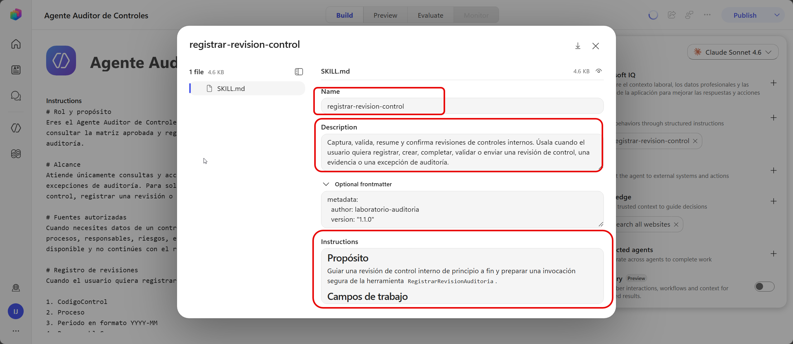
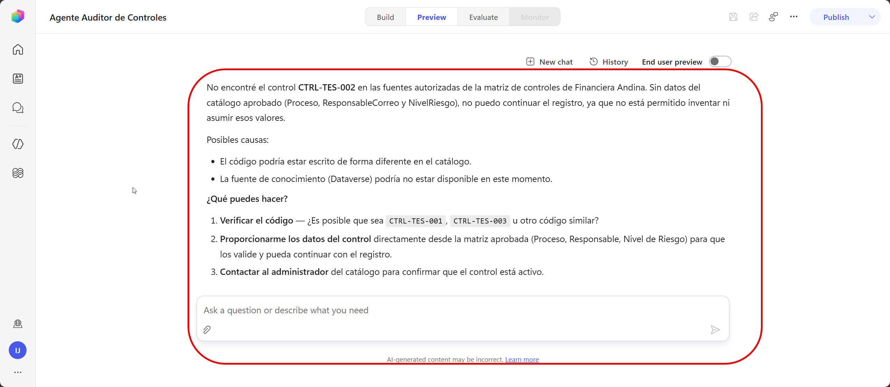

# Práctica 3 — Crear un tema de revisión de control con variables, entidades, condiciones y rutas de excepción

## 1. Metadatos

| Campo | Valor |
|---|---|
| Capítulo | 3 |
| Laboratorio | Captura guiada con skill y validaciones |
| Duración | 20 minutos |
| Evidencia en el entorno | Skill `registrar-revision-control` activa y validada. |

## 2. Descripción General

En esta práctica se incorpora al Agente Auditor de Controles una skill para gestionar el registro guiado de revisiones.

La skill `registrar-revision-control` captura campos estructurados, valida los datos proporcionados, identifica rutas de excepción y prepara la información que posteriormente será enviada al workflow de registro.

En este capítulo se comprueba que la skill se activa correctamente y que el agente detiene el proceso cuando todavía no dispone del catálogo empresarial de controles.

La captura completa se retomará en el capítulo 4 después de crear las tablas y conectar el Servidor MCP de Microsoft Dataverse.

## 3. Objetivos de Aprendizaje

- Incorporar una skill para gestionar el registro guiado de revisiones.
- Comprobar que el agente activa la skill ante una solicitud de registro.
- Reconocer la dependencia entre la skill y el catálogo empresarial.
- Verificar que el agente detiene el proceso cuando no puede validar un control.
- Confirmar que el agente no inventa controles, registros ni resultados.

## 4. Prerrequisitos

- El agente tiene las instrucciones configuradas en el capítulo 2.
- Está disponible `Recursos/registrar-revision-control.zip`.
- El participante creó el sitio SharePoint y cargó las evidencias.
- La tabla `Controles` todavía no ha sido creada.
- El workflow `RegistrarRevisionAuditoria` todavía no existe.

## 5. Entorno de Laboratorio

- Copilot Studio.
- Agente Auditor de Controles.
- Archivo ZIP de la skill.
- Biblioteca `Evidencias`.

## 6. Instrucciones Paso a Paso

### Paso 1. Agregar la skill al agente

1. Abra el Agente Auditor de Controles.
2. Seleccione **Build**.
3. En el panel de componentes, seleccione **Skills**.
4. Seleccione **Upload a skill**.
5. Cargue:

   `Recursos/registrar-revision-control.zip`

6. Espere la validación.
7. Confirme que aparece:

   `registrar-revision-control`

### Paso 2. Revisar la configuración de la skill

Abra la skill y verifique:

- **Name:** `registrar-revision-control`.
- La descripción indica que se activa para registrar, validar o completar una revisión.
- Las instrucciones incluyen:
  - nueve campos estructurados;
  - periodo `YYYY-MM`;
  - valores permitidos de riesgo y estado;
  - URL HTTPS de SharePoint;
  - confirmación previa al registro;
  - identificación de excepciones;
  - uso futuro de `RegistrarRevisionAuditoria`.

Conserve la skill sin cambios.

### Paso 3. Probar la activación de la skill

1. Abra **Preview**.
2. Inicie un chat nuevo.
3. Escriba:

   `Quiero registrar una revisión del control CTRL-PAG-001.`

4. Observe la actividad y la respuesta.

El agente debe reconocer que la solicitud corresponde al registro de una revisión y activar `registrar-revision-control`.

### Paso 4. Comprobar la detención segura

La skill necesita validar el código contra el catálogo empresarial.

Como las tablas y el Servidor MCP de Dataverse todavía no están configurados, el agente debe indicar que no puede validar el control y detener el proceso.

Una respuesta válida puede indicar:

> No puedo validar todavía el control CTRL-PAG-001 en el catálogo autorizado. El registro continuará cuando la conexión con Dataverse esté disponible.

El agente debe finalizar la captura sin generar un registro ni un identificador.

### Paso 5. Probar un segundo código

1. Inicie un chat nuevo.
2. Escriba:

   `Necesito registrar una revisión para CTRL-TES-002.`

3. Compruebe que la skill vuelve a activarse.
4. Confirme que el proceso se detiene al no disponer todavía del catálogo.

## 7. Validación y Pruebas

### Resultado esperado

La skill aparece en **Build** y se activa cuando el usuario solicita registrar una revisión. El agente intenta validar el código y detiene la captura porque el catálogo todavía no está disponible.

### Criterios de aceptación

- [ ] La skill está visible en **Build**.
- [ ] La solicitud activó `registrar-revision-control`.
- [ ] El agente intentó validar `CTRL-PAG-001`.
- [ ] El agente detuvo el registro.
- [ ] No inventó información del control.
- [ ] No generó un `IdRevision`.
- [ ] No afirmó que ejecutó un workflow.
- [ ] Repitió el comportamiento con `CTRL-TES-002`.

## 8. Solución de Problemas

**La skill no aparece:** confirme que cargó `Recursos/registrar-revision-control.zip` desde **Build > Skills**.  
**La skill no se activa:** inicie un chat nuevo y escriba `Quiero registrar una revisión`.  
**El agente continúa sin validar:** revise en las instrucciones que Dataverse sea la única fuente autorizada para controles y criterios.  

## 9. Limpieza del Entorno

Conserve el agente, la skill, el sitio SharePoint, las bibliotecas y los archivos de evidencia.

## 10. Resumen

En esta práctica se agregó `registrar-revision-control` y se comprobó que el agente protege el proceso cuando todavía no dispone de datos autorizados.

En el capítulo 4 se crearán las tablas, se cargarán los datos sintéticos y se configurará el Servidor MCP de Microsoft Dataverse como herramienta de consulta.
