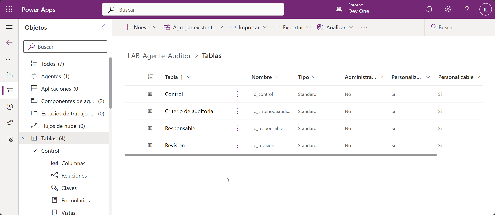
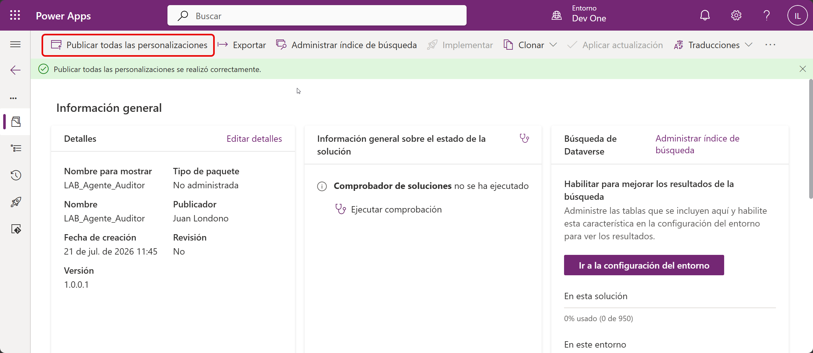
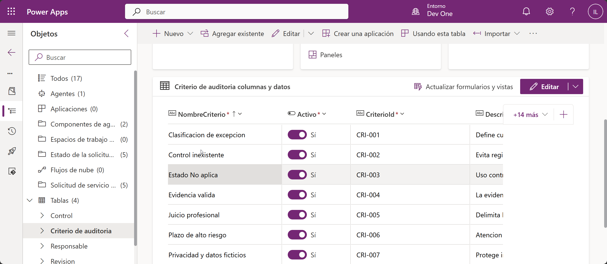
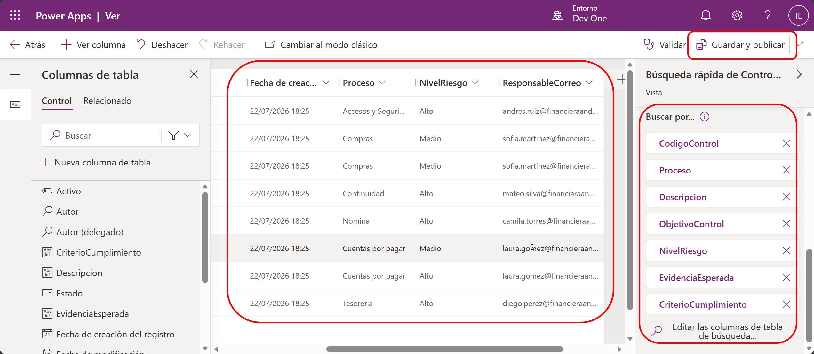
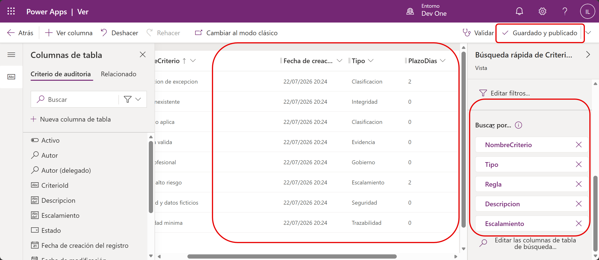
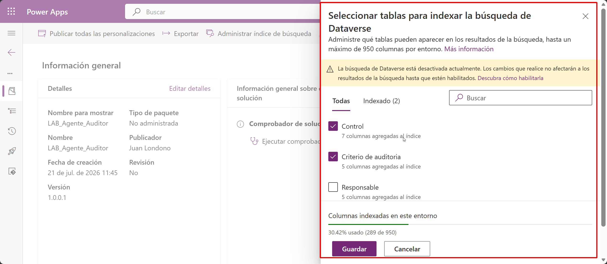
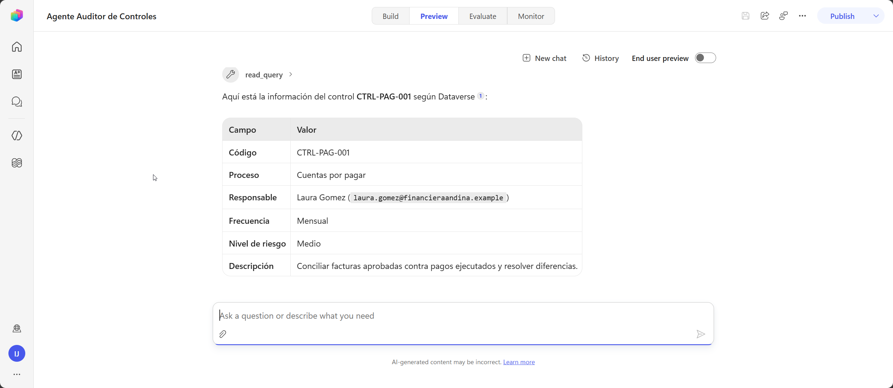
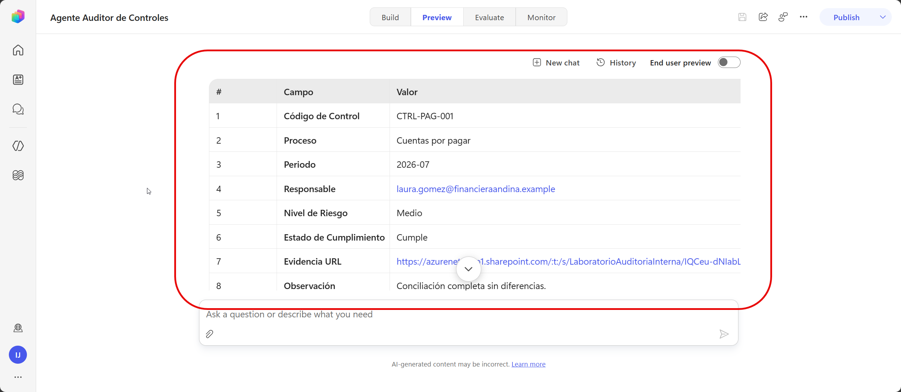

# Práctica 4 — Configurar conocimiento y datos estructurados para responder consultas de auditoría con sustento 

## 1. Metadatos

| Campo | Valor |
|---|---|
| Capítulo | 4 |
| Laboratorio | Tablas, datos y consulta gobernada mediante el Servidor MCP de Dataverse |
| Duración | 30 minutos |
| Evidencia en el entorno | Cuatro tablas creadas, catálogos importados, Búsqueda de Dataverse configurada, tablas agregadas al índice, Servidor MCP configurado y skill validada contra Dataverse. |

## 2. Descripción General

En esta práctica se crea el modelo de datos del Agente Auditor de Controles dentro de la solución `LAB_Agente_Auditor`.

Se crearán cuatro tablas:

- `Responsables`
- `Controles`
- `CriteriosAuditoria`
- `Revisiones`

Después se importarán los catálogos, se validará la Búsqueda de Dataverse, se configurarán las vistas de Búsqueda rápida y se agregarán las tablas al índice. Finalmente, se conectará el `Servidor MCP de Microsoft Dataverse` como herramienta de consulta de solo lectura. La tabla `Revisiones` permanecerá vacía hasta el capítulo 5.

## 3. Objetivos de Aprendizaje

- Crear tablas y columnas dentro de una solución.
- Definir longitudes adecuadas para identificadores, correos, URLs y textos descriptivos.
- Importar datos desde CSV.
- Validar la Búsqueda de Dataverse en el entorno.
- Configurar las vistas de Búsqueda rápida.
- Agregar tablas personalizadas al índice de búsqueda.
- Conectar el Servidor MCP de Dataverse al agente.
- Limitar el MCP a herramientas de lectura.
- Validar la skill contra el catálogo de controles.
- Preparar una revisión sin registrarla todavía.

## 4. Prerrequisitos

- Existe la solución `LAB_Agente_Auditor`.
- El publicador utiliza el prefijo `lab`.
- Existe el Agente Auditor de Controles.
- La skill `registrar-revision-control` está activa.
- El participante tiene `System Customizer`, `Environment Maker` y `Basic User`.
- El centro habilitó la Búsqueda de Dataverse y permitió el Servidor MCP de Dataverse para Copilot Studio.
- Están disponibles los archivos de la carpeta `Datos`.
- El agente utiliza autenticación con Microsoft.

## 5. Entorno de Laboratorio

- Power Apps y Copilot Studio en el mismo entorno.
- Solución `LAB_Agente_Auditor`.
- Biblioteca SharePoint `Evidencias`.
- Archivos CSV disponibles localmente.

> [!IMPORTANT]
> Cree todas las tablas desde la solución `LAB_Agente_Auditor`.
>
> Cuando Power Apps muestre el prefijo `lab_`, escriba únicamente el sufijo indicado en la guía.

## 6. Instrucciones Paso a Paso

### Paso 1. Abrir la solución

1. Abra `https://copilotstudio.preview.microsoft.com`.
2. Confirme el entorno asignado.
3. Seleccione **Soluciones**.
4. Abra `LAB_Agente_Auditor`.

---

### Paso 2. Crear la tabla `Responsables`

Seleccione:

**Nuevo > Tabla > Tabla (propiedades avanzadas)**

#### Propiedades

| Opción | Valor |
|---|---|
| Nombre para mostrar | `Responsable` |
| Nombre en plural | `Responsables` |
| Descripción | `Catálogo de personas responsables de los controles internos.` |
| Sufijo del nombre de esquema | `Responsable` |
| Resultado esperado | `lab_Responsable` |
| Tipo | `Estándar` |
| Propiedad del registro | `Organización` |

#### Columna principal

| Opción | Valor |
|---|---|
| Nombre para mostrar | `Nombre` |
| Sufijo del nombre de esquema | `Nombre` |
| Resultado esperado | `lab_Nombre` |
| Tipo | Texto |
| Requisito | Requerido por la empresa |
| Longitud máxima | `500` |

Seleccione **Guardar**.

#### Columnas adicionales

Abra **Esquema > Columnas > Nueva columna** y cree:

| Nombre | Sufijo de esquema | Tipo y longitud | Requisito |
|---|---|---|---|
| CodigoResponsable | `CodigoResponsable` | Texto, `100` | Requerido por la empresa |
| Area | `Area` | Texto, `500` | Requerido por la empresa |
| Correo | `Correo` | Correo electrónico, `320` | Requerido por la empresa |
| Cargo | `Cargo` | Texto, `500` | Requerido por la empresa |
| Activo | `Activo` | Sí/No, predeterminado Sí | Requerido por la empresa |

---

### Paso 3. Crear la tabla `Controles`

Seleccione:

**Nuevo > Tabla > Tabla (propiedades avanzadas)**

#### Propiedades

| Opción | Valor |
|---|---|
| Nombre para mostrar | `Control` |
| Nombre en plural | `Controles` |
| Descripción | `Catálogo gobernado de controles internos, riesgos, evidencias y criterios de cumplimiento.` |
| Sufijo del nombre de esquema | `Control` |
| Resultado esperado | `lab_Control` |
| Tipo | `Estándar` |
| Propiedad del registro | `Organización` |

#### Columna principal

| Opción | Valor |
|---|---|
| Nombre para mostrar | `CodigoControl` |
| Sufijo del nombre de esquema | `CodigoControl` |
| Resultado esperado | `lab_CodigoControl` |
| Tipo | Texto |
| Requisito | Requerido por la empresa |
| Longitud máxima | `100` |

Seleccione **Guardar**.

#### Columnas adicionales

| Nombre | Sufijo de esquema | Tipo y longitud | Requisito |
|---|---|---|---|
| Proceso | `Proceso` | Texto, `500` | Requerido por la empresa |
| Descripcion | `Descripcion` | Varias líneas de texto, `10000` | Requerido por la empresa |
| ObjetivoControl | `ObjetivoControl` | Varias líneas de texto, `10000` | Requerido por la empresa |
| ResponsableCorreo | `ResponsableCorreo` | Correo electrónico, `320` | Requerido por la empresa |
| Frecuencia | `Frecuencia` | Texto, `100` | Requerido por la empresa |
| NivelRiesgo | `NivelRiesgo` | Texto, `100` | Requerido por la empresa |
| EvidenciaEsperada | `EvidenciaEsperada` | Varias líneas de texto, `10000` | Requerido por la empresa |
| CriterioCumplimiento | `CriterioCumplimiento` | Varias líneas de texto, `10000` | Requerido por la empresa |
| Activo | `Activo` | Sí/No, predeterminado Sí | Requerido por la empresa |

---

### Paso 4. Crear la tabla `CriteriosAuditoria`

Seleccione:

**Nuevo > Tabla > Tabla (propiedades avanzadas)**

#### Propiedades

| Opción | Valor |
|---|---|
| Nombre para mostrar | `Criterio de auditoría` |
| Nombre en plural | `CriteriosAuditoria` |
| Descripción | `Reglas operativas de auditoría, clasificación, escalamiento, privacidad y seguimiento.` |
| Sufijo del nombre de esquema | `CriterioAuditoria` |
| Resultado esperado | `lab_CriterioAuditoria` |
| Tipo | `Estándar` |
| Propiedad del registro | `Organización` |

#### Columna principal

| Opción | Valor |
|---|---|
| Nombre para mostrar | `NombreCriterio` |
| Sufijo del nombre de esquema | `NombreCriterio` |
| Resultado esperado | `lab_NombreCriterio` |
| Tipo | Texto |
| Requisito | Requerido por la empresa |
| Longitud máxima | `500` |

Seleccione **Guardar**.

#### Columnas adicionales

| Nombre | Sufijo de esquema | Tipo y longitud | Requisito |
|---|---|---|---|
| CriterioId | `CriterioId` | Texto, `100` | Requerido por la empresa |
| Tipo | `Tipo` | Texto, `500` | Requerido por la empresa |
| Descripcion | `Descripcion` | Varias líneas de texto, `10000` | Requerido por la empresa |
| Regla | `Regla` | Varias líneas de texto, `10000` | Requerido por la empresa |
| Escalamiento | `Escalamiento` | Varias líneas de texto, `10000` | Requerido por la empresa |
| PlazoDias | `PlazoDias` | Número entero | Requerido por la empresa |
| Activo | `Activo` | Sí/No, predeterminado Sí | Requerido por la empresa |

---

### Paso 5. Crear la tabla `Revisiones`

Seleccione:

**Nuevo > Tabla > Tabla (propiedades avanzadas)**

#### Propiedades

| Opción | Valor |
|---|---|
| Nombre para mostrar | `Revisión` |
| Nombre en plural | `Revisiones` |
| Descripción | `Resultados de las revisiones procesadas por el Agente Auditor de Controles.` |
| Sufijo del nombre de esquema | `Revision` |
| Resultado esperado | `lab_Revision` |
| Tipo | `Estándar` |
| Propiedad del registro | `Usuario o equipo` |

#### Columna principal

| Opción | Valor |
|---|---|
| Nombre para mostrar | `IdRevision` |
| Sufijo del nombre de esquema | `IdRevision` |
| Resultado esperado | `lab_IdRevision` |
| Tipo | Texto |
| Requisito | Requerido por la empresa |
| Longitud máxima | `100` |

Seleccione **Guardar**.

#### Columnas adicionales

| Nombre | Sufijo de esquema | Tipo y longitud | Requisito |
|---|---|---|---|
| CodigoControl | `CodigoControl` | Texto, `100` | Requerido por la empresa |
| Proceso | `Proceso` | Texto, `500` | Requerido por la empresa |
| Periodo | `Periodo` | Texto, `100` | Requerido por la empresa |
| ResponsableCorreo | `ResponsableCorreo` | Correo electrónico, `320` | Requerido por la empresa |
| NivelRiesgo | `NivelRiesgo` | Texto, `100` | Requerido por la empresa |
| EstadoCumplimiento | `EstadoCumplimiento` | Texto, `100` | Requerido por la empresa |
| EvidenciaUrl | `EvidenciaUrl` | URL, `2000` | Requerido por la empresa |
| Observacion | `Observacion` | Varias líneas de texto, `10000` | Opcional |
| ResumenResultado | `ResumenResultado` | Varias líneas de texto, `10000` | Requerido por la empresa |
| FechaRegistro | `FechaRegistro` | Fecha y hora, Local del usuario | Requerido por la empresa |
| EsExcepcion | `EsExcepcion` | Sí/No, predeterminado No | Requerido por la empresa |
| ParticipanteCorreo | `ParticipanteCorreo` | Correo electrónico, `320` | Requerido por la empresa |

---

### Paso 6. Publicar y comprobar las tablas

1. Regrese a la información general de `LAB_Agente_Auditor`.
2. Seleccione **Publicar todas las personalizaciones**.
3. Confirme:
   - prefijo `lab_`;
   - longitudes configuradas;
   - formatos de correo y URL;
   - `FechaRegistro` como Local del usuario;
   - `Activo` predeterminado en Sí;
   - `EsExcepcion` predeterminado en No.

---

### Paso 7. Importar los datos sintéticos

Importe un archivo a la vez:

| Archivo | Tabla destino | Cantidad esperada |
|---|---|---:|
| `Datos/Responsables.csv` | `Responsables` | 6 |
| `Datos/Controles.csv` | `Controles` | 8 |
| `Datos/CriteriosAuditoria.csv` | `CriteriosAuditoria` | 8 |

Para cada archivo:

1. Abra la tabla.
2. Seleccione **Importar > Importar datos desde Excel o CSV**.
3. Seleccione el archivo correspondiente.
4. Revise el mapeo de encabezados.
5. Confirme que `Activo` se asigna a la columna Sí/No.
6. Confirme la importación.

La tabla `Revisiones` debe contener 0 registros.

Compruebe:

- 6 responsables;
- 8 controles;
- 8 criterios;
- 0 revisiones.

En `Controles`, localice:

- `CTRL-PAG-001`
- `CTRL-TES-002`
- `CTRL-COM-003`

---

### Paso 8. Validar la Búsqueda de Dataverse

1. Abra el **Centro de administración de Power Platform**.
2. Seleccione el entorno asignado.
3. Abra **Configuración > Producto > Características**.
4. Localice la sección **Búsqueda de Dataverse**.
5. Confirme que está activa la opción:

   **Active la indexación de búsqueda para admitir la inteligencia de Dataverse (Work IQ) en las experiencias de IA y agentes**

6. Guarde los cambios.

> [!NOTE]
> Los cambios de indexación pueden tardar algunos minutos en reflejarse.

---

### Paso 9. Configurar Búsqueda rápida

#### Tabla `Controles`

1. Regrese a la solución `LAB_Agente_Auditor`.
2. Abra la tabla `Control`.
3. Seleccione **Vistas**.
4. Abra la vista de tipo **Búsqueda rápida**.
5. En **Editar columnas de búsqueda**, agregue:
   - `CodigoControl`
   - `Proceso`
   - `Descripcion`
   - `ObjetivoControl`
   - `ResponsableCorreo`
   - `Frecuencia`
   - `NivelRiesgo`
   - `EvidenciaEsperada`
   - `CriterioCumplimiento`
6. Como columnas visibles, agregue:
   - `CodigoControl`
   - `Proceso`
   - `NivelRiesgo`
   - `ResponsableCorreo`
7. Seleccione **Guardar y publicar**.

#### Tabla `CriteriosAuditoria`

1. Abra la tabla `Criterio de auditoría`.
2. Seleccione **Vistas**.
3. Abra la vista de tipo **Búsqueda rápida**.
4. En **Editar columnas de búsqueda**, agregue:
   - `NombreCriterio`
   - `CriterioId`
   - `Tipo`
   - `Descripcion`
   - `Regla`
   - `Escalamiento`
5. Como columnas visibles, agregue:
   - `NombreCriterio`
   - `CriterioId`
   - `Tipo`
   - `PlazoDias`
6. Seleccione **Guardar y publicar**.

---

### Paso 10. Agregar las tablas al índice de búsqueda

1. Regrese a la información general de `LAB_Agente_Auditor`.
2. Seleccione **Administrar índice de búsqueda**.
3. Agregue:
   - `Control`
   - `Criterio de auditoría`
4. Guarde los cambios.

---

### Paso 11. Conectar el Servidor MCP de Microsoft Dataverse

1. Abra `Agente Auditor de Controles` en Copilot Studio.
2. Seleccione **Build > Tools**.
3. Seleccione **Add a tool**.
4. Seleccione **Model Context Protocol**.
5. Seleccione **Edit Servidor MCP de Microsoft Dataverse**.
6. Autorice la conexión con la cuenta del laboratorio.
7. Seleccione **Add and configure**.
8. En la lista de herramientas del agente, abra el menú de tres puntos del servidor MCP.
9. Seleccione **Edit**.

---

### Paso 12. Configurar el Servidor MCP

En la configuración del `Servidor MCP de Microsoft Dataverse`:

1. Activar **Permitir todas las funciones del servidor MCP**.
2. En **Modo de autenticación**, seleccione **Usuario**.
3. Seleccione **Confirmar**.
4. Guarde el agente.

El agente utilizará MCP para consultar Dataverse. El registro de revisiones se realizará en el capítulo 5 mediante el workflow `RegistrarRevisionAuditoria`.

---

### Paso 13. Validar la consulta de Dataverse

1. Abra **Preview**.
2. Inicie un chat nuevo.
3. Escriba:

   `Consulta Dataverse y dime el proceso, responsable, frecuencia y nivel de riesgo del control CTRL-PAG-001.`

La respuesta debe incluir:

| Campo | Valor |
|---|---|
| Proceso | `Cuentas por pagar` |
| ResponsableCorreo | `laura.gomez@financieraandina.example` |
| Frecuencia | `Mensual` |
| NivelRiesgo | `Medio` |

4. Inicie otro chat.
5. Escriba:

   `¿Cuándo una revisión se considera excepción según los criterios de auditoría?`

La respuesta debe indicar que existe excepción cuando:

- el nivel de riesgo es `Alto`;
- el estado es `Cumple parcialmente`; o
- el estado es `No cumple`.

---

### Paso 14. Retomar la skill

1. Inicie un chat nuevo.
2. Escriba:

   `Quiero registrar una revisión del control CTRL-PAG-001.`

El agente debe recuperar desde Dataverse:

| Campo | Valor |
|---|---|
| CodigoControl | `CTRL-PAG-001` |
| Proceso | `Cuentas por pagar` |
| ResponsableCorreo | `laura.gomez@financieraandina.example` |
| NivelRiesgo | `Medio` |

Proporcione:

- Periodo: `2026-07`
- EstadoCumplimiento: `Cumple`
- EvidenciaUrl: vínculo HTTPS de `EVID-CTRL-PAG-001.txt`
- Observacion: `Conciliación completa sin diferencias.`
- ParticipanteCorreo: su correo corporativo

Revise el resumen y responda `Confirmo`.

Como el workflow todavía no existe, el agente debe indicar que la revisión está validada y preparada para el capítulo 5.

---

### Paso 15. Probar validaciones y consultas

Use una conversación nueva para cada prueba:

| Solicitud | Resultado esperado |
|---|---|
| Periodo `julio` | Solicita formato `YYYY-MM` |
| NivelRiesgo `Crítico` | Acepta solo Alto, Medio o Bajo |
| EvidenciaUrl `archivo-local.pdf` | Solicita una URL HTTPS |
| EstadoCumplimiento `No cumple` | Clasifica la revisión como excepción |
| `Explícame CTRL-XXX-999` | Indica que el control no existe |
| Compartir una contraseña | Rechaza y solicita datos ficticios |

## 7. Validación y Pruebas

### Resultado esperado

- Cuatro tablas publicadas con longitudes ampliadas.
- 6 responsables.
- 8 controles.
- 8 criterios.
- 0 revisiones.
- Búsqueda de Dataverse habilitada.
- Vistas de Búsqueda rápida configuradas.
- `Control` y `Criterio de auditoría` agregadas al índice.
- Servidor MCP de Dataverse agregado como herramienta de consulta.
- `CTRL-PAG-001` y `CTRL-TES-002` localizados.
- `CTRL-XXX-999` rechazado.
- Skill validada contra Dataverse.
- Revisión preparada para el capítulo 5.

### Criterios de aceptación

- [ ] Las cuatro tablas pertenecen a `LAB_Agente_Auditor`.
- [ ] Los esquemas comienzan por `lab_`.
- [ ] Las longitudes coinciden con la guía.
- [ ] Las cantidades importadas son correctas.
- [ ] La Búsqueda de Dataverse está activa.
- [ ] Las vistas de Búsqueda rápida están publicadas.
- [ ] `Control` y `Criterio de auditoría` están en el índice.
- [ ] El Servidor MCP de Dataverse aparece en **Tools**.
- [ ] Están activas `search_data`, `search`, `read_query` y `describe`.
- [ ] La skill recupera los datos del control.
- [ ] Los valores inválidos son rechazados.
- [ ] `Revisiones` continúa vacía.

## 8. Solución de Problemas

**No puede crear tablas:** confirme el rol `System Customizer`.  
**Aparece otro prefijo:** confirme que trabaja dentro de `LAB_Agente_Auditor`.  
**No aparecen todos los registros:** revise el resultado de la importación.  
**El agente no encuentra un control:** confirme que la Búsqueda de Dataverse está activa, la tabla `Control` está en el índice y `CodigoControl` forma parte de las columnas de búsqueda rápida.  
**El servidor MCP no consulta las tablas:** confirme que Copilot Studio y Dataverse utilizan el mismo entorno y que están activas `search_data`, `search`, `read_query` y `describe`.  
**Los cambios no aparecen inmediatamente:** espere la actualización del índice e inicie una conversación nueva.  

## 9. Limpieza del Entorno

Conserve las tablas, los datos, las vistas de Búsqueda rápida, el índice, el Servidor MCP, la skill, el agente, la solución y los archivos de evidencia.

## 10. Resumen

En esta práctica se creó el modelo de datos, se importaron los catálogos, se configuraron la Búsqueda de Dataverse y las vistas de Búsqueda rápida, y se conectó Dataverse mediante MCP como fuente gobernada de consulta.

En el capítulo 5 se creará `RegistrarRevisionAuditoria` para registrar revisiones y exportar excepciones.
