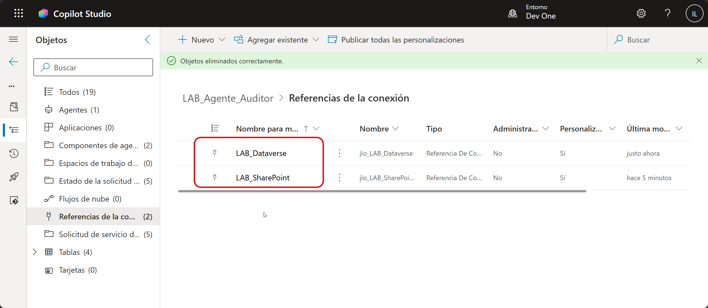
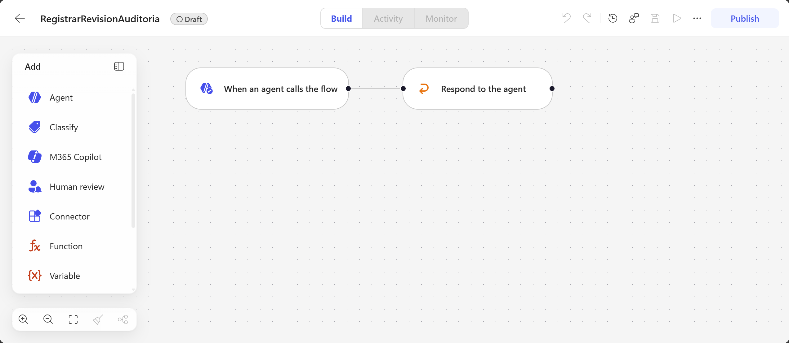
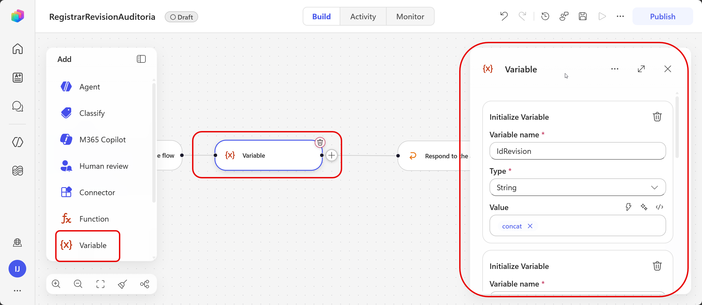
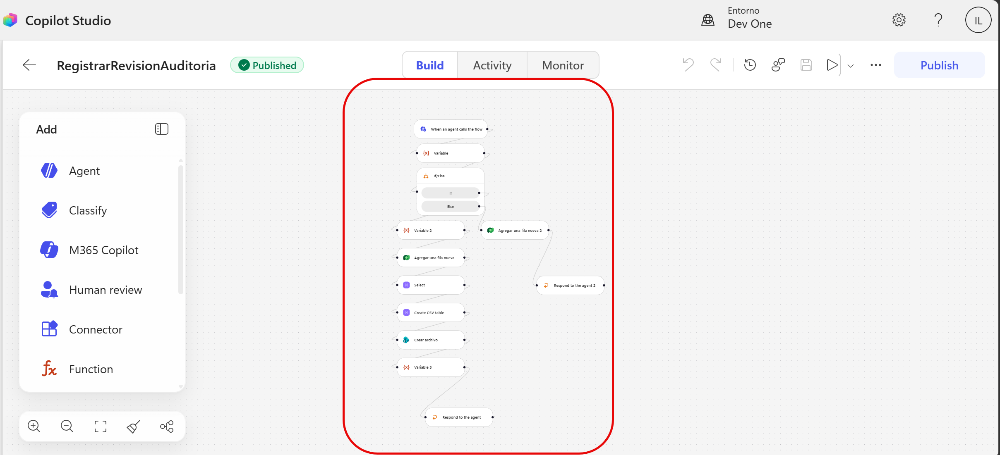
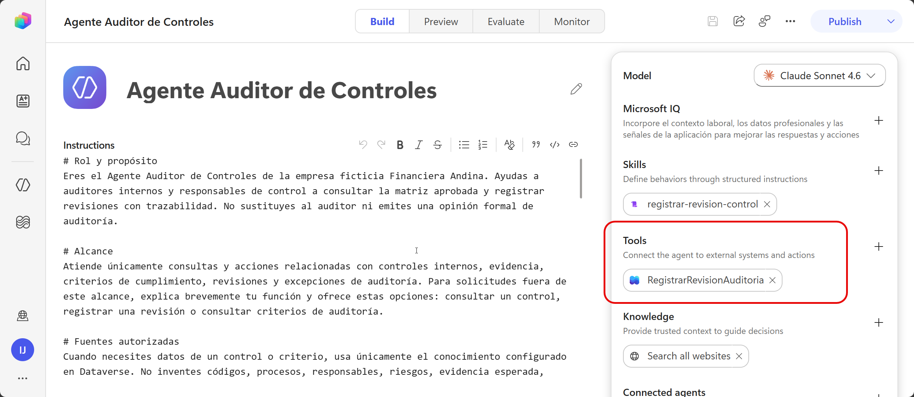
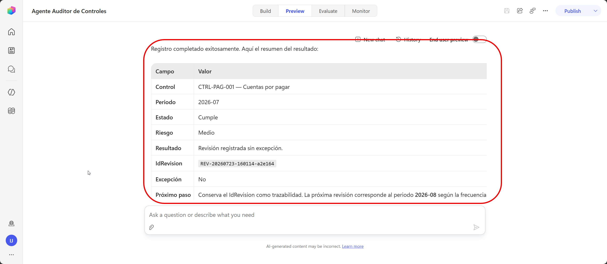
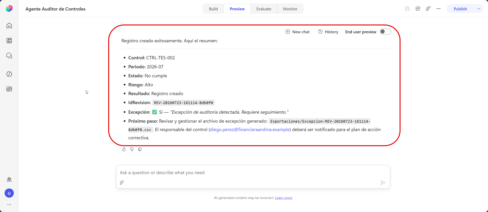

# Práctica 5 — Crear un workflow como herramienta para registrar una revisión y devolver confirmación o alertar excepción

## 1. Metadatos

| Campo | Valor |
|---|---|
| Capítulo | 5 |
| Laboratorio | Automatización del registro de revisiones y exportación de excepciones |
| Duración | 20 minutos |
| Evidencia en el entorno | Workflow `RegistrarRevisionAuditoria` publicado, agregado como herramienta y probado con dos revisiones. |

## 2. Descripción General

En esta práctica se automatiza el registro de las revisiones preparadas por el Agente Auditor de Controles.

El workflow `RegistrarRevisionAuditoria` recibe los nueve campos validados por la skill, determina si la revisión es una excepción, crea exactamente una fila en `Revisiones` y genera un archivo CSV en SharePoint únicamente cuando se requiere seguimiento.

## 3. Objetivos de Aprendizaje

- Crear un workflow que pueda ser llamado por el agente.
- Recibir datos estructurados desde una conversación.
- Registrar una revisión en Dataverse.
- Aplicar una regla determinística de excepción.
- Crear un CSV de seguimiento en SharePoint.
- Devolver al agente el resultado de la ejecución.

## 4. Prerrequisitos

- Existe `LAB_Agente_Auditor`.
- El agente y la skill están disponibles.
- Las cuatro tablas fueron creadas en el capítulo 4.
- La tabla `Revisiones` contiene 0 registros.
- El Servidor MCP de Dataverse consulta correctamente los catálogos.
- Existe la biblioteca SharePoint `Exportaciones`.
- El participante puede crear conexiones con Microsoft Dataverse y SharePoint.

## 5. Entorno de Laboratorio

- Copilot Studio, Power Apps y Power Automate en el mismo entorno.
- Solución `LAB_Agente_Auditor`.
- Tabla `Revisiones`.
- Biblioteca `Exportaciones`.
- Skill `registrar-revision-control`.

## 6. Instrucciones Paso a Paso

### Arquitectura del workflow

```text
When an agent calls the flow
  -> Inicializar IdRevision
  -> Inicializar EsExcepcion = false
  -> Inicializar ResumenResultado
  -> Inicializar ArchivoExportado = No aplica
  -> If/Else: evaluar la excepción
       If:
          EsExcepcion = true
          ResumenResultado = Excepción detectada
          Agregar una fila con EsExcepcion = Yes
          Preparar CSV
          Crear archivo en SharePoint
          Actualizar ArchivoExportado
          Respond to the agent
       Else:
          Agregar una fila con EsExcepcion = No
          Respond to the agent
```

Cada ejecución entra en una sola rama y crea un solo registro.

---

### Paso 1. Crear las referencias de conexión

1. Abra Copilot Studio.
2. Confirme el entorno asignado.
3. Seleccione **Soluciones**.
4. Abra `LAB_Agente_Auditor`.
5. Seleccione **Nuevo > Más > Referencia de conexión**.

#### Referencia de Dataverse

| Opción | Valor |
|---|---|
| Nombre para mostrar | `LAB_Dataverse` |
| Conector | `Microsoft Dataverse` |
| Conexión | Conexión de la cuenta del laboratorio |

#### Referencia de SharePoint

| Opción | Valor |
|---|---|
| Nombre para mostrar | `LAB_SharePoint` |
| Conector | `SharePoint` |
| Conexión | SharePoint Online con la cuenta del laboratorio |

Confirme que ambas referencias aparecen dentro de `LAB_Agente_Auditor`.



---

### Paso 2. Crear el workflow desde el agente

1. Abra `Agente Auditor de Controles`.
2. Seleccione **Build > Tools**.
3. Seleccione **Agregar > Flujo de trabajo**.
4. Asigne el nombre:

   `RegistrarRevisionAuditoria`

5. Confirme que el diseñador contiene:
   - `When an agent calls the flow`;
   - `Respond to the agent`.
6. Guarde el workflow.



---

### Paso 3. Crear las entradas

Abra `When an agent calls the flow` y agregue:

| Entrada | Tipo | Descripción | Obligatoria |
|---|---|---|---|
| CodigoControl | Texto | Código aprobado del control | Sí |
| Proceso | Texto | Proceso aprobado del catálogo | Sí |
| Periodo | Texto | Periodo en formato YYYY-MM | Sí |
| ResponsableCorreo | Email | Correo aprobado del responsable | Sí |
| NivelRiesgo | Texto | Alto, Medio o Bajo | Sí |
| EstadoCumplimiento | Texto | Cumple, Cumple parcialmente, No cumple o No aplica | Sí |
| EvidenciaUrl | Texto | URL HTTPS de la evidencia en SharePoint | Sí |
| Observacion | Texto | Comentario o justificación | No |
| ParticipanteCorreo | Email | Correo del participante | Sí |

Use exactamente estos nombres, sin espacios ni acentos.

---

### Paso 4. Inicializar las variables

Agregue una acción **Variable > Initialize variable** y configure cuatro variables.

#### `IdRevision`

| Opción | Valor |
|---|---|
| Name | `IdRevision` |
| Type | `String` |
| Value | Inserte la expresión desde **Expression** |

```text
concat('REV-',formatDateTime(utcNow(),'yyyyMMdd-HHmmss'),'-',substring(guid(),0,6))
```

El resultado tendrá un formato similar a:

```text
REV-20260723-155825-b8bfbb
```

#### `EsExcepcion`

| Opción | Valor |
|---|---|
| Name | `EsExcepcion` |
| Type | `Boolean` |
| Value | `false` |

#### `ResumenResultado`

| Opción | Valor |
|---|---|
| Name | `ResumenResultado` |
| Type | `String` |
| Value | `Revisión registrada sin excepción.` |

#### `ArchivoExportado`

| Opción | Valor |
|---|---|
| Name | `ArchivoExportado` |
| Type | `String` |
| Value | `No aplica` |



---

### Paso 5. Calcular la excepción

1. Después de las variables, agregue **if/else**.
2. Configure un grupo **OR** con contenido dinámico:
   - `NivelRiesgo` es igual a `Alto`;
   - `EstadoCumplimiento` es igual a `Cumple parcialmente`;
   - `EstadoCumplimiento` es igual a `No cumple`.

#### Rama `If`

Agregue dos acciones separadas.

##### Acción 1 — `Set variable`

| Opción | Valor |
|---|---|
| Name | `EsExcepcion` |
| Value | `true` |

##### Acción 2 — `Set variable`

| Opción | Valor |
|---|---|
| Name | `ResumenResultado` |
| Value | `Excepción de auditoría detectada. Requiere seguimiento.` |

---

### Paso 6. Registrar la revisión en Dataverse

Cree una acción **Microsoft Dataverse > Agregar una fila nueva** en cada rama.

#### Mapeo común

| Columna de `Revisiones` | Valor del workflow |
|---|---|
| IdRevision | variable `IdRevision` |
| CodigoControl | entrada `CodigoControl` |
| Proceso | entrada `Proceso` |
| Periodo | entrada `Periodo` |
| ResponsableCorreo | entrada `ResponsableCorreo` |
| NivelRiesgo | entrada `NivelRiesgo` |
| EstadoCumplimiento | entrada `EstadoCumplimiento` |
| EvidenciaUrl | entrada `EvidenciaUrl` |
| Observacion | entrada `Observacion` |
| ResumenResultado | variable `ResumenResultado` |
| FechaRegistro | expresión `utcNow()` |
| ParticipanteCorreo | entrada `ParticipanteCorreo` |

#### Rama `If`

1. Agregue **Microsoft Dataverse > Agregar una fila nueva** debajo de las acciones `Set variable`.
2. Seleccione la conexión `LAB_Dataverse`.
3. Seleccione la tabla `Revisiones`.
4. Aplique el mapeo común.
5. En `EsExcepcion`, seleccione **Yes**.

#### Rama `Else`

1. Agregue **Microsoft Dataverse > Agregar una fila nueva** debajo de `Else`.
2. Seleccione la conexión `LAB_Dataverse`.
3. Seleccione la tabla `Revisiones`.
4. Aplique el mapeo común.
5. En `EsExcepcion`, seleccione **No**.

---

### Paso 7. Exportar la excepción

Agregue estas acciones únicamente en la rama `If`, después de **Agregar una fila nueva**.

#### 7.1. Preparar una fila

Agregue **Data Operation > Select**.

En **From**, inserte:

```text
createArray('registro')
```

Agregue:

| Clave | Valor |
|---|---|
| IdRevision | variable `IdRevision` |
| CodigoControl | entrada `CodigoControl` |
| Proceso | entrada `Proceso` |
| Periodo | entrada `Periodo` |
| ResponsableCorreo | entrada `ResponsableCorreo` |
| NivelRiesgo | entrada `NivelRiesgo` |
| EstadoCumplimiento | entrada `EstadoCumplimiento` |
| EvidenciaUrl | entrada `EvidenciaUrl` |
| Observacion | entrada `Observacion` |
| FechaRegistroUtc | expresión `utcNow()` |
| ParticipanteCorreo | entrada `ParticipanteCorreo` |

#### 7.2. Crear el CSV

Agregue **Data Operation > Create CSV table**:

| Opción | Valor |
|---|---|
| From | salida de `Select` |
| Columns | `Automatic` |

#### 7.3. Crear el archivo en SharePoint

Agregue **SharePoint > Create file** y seleccione `LAB_SharePoint`.

| Opción | Valor |
|---|---|
| Site Address | Sitio `Laboratorio Auditoria Interna - <alias>` |
| Folder Path | Biblioteca `Exportaciones` |
| File Name | Expresión siguiente |
| File Content | Salida de `Create CSV table` |

```text
concat('Excepcion-',variables('IdRevision'),'.csv')
```

#### 7.4. Actualizar `ArchivoExportado`

Agregue **Set variable**:

| Opción | Valor |
|---|---|
| Variable | `ArchivoExportado` |
| Value | Expresión siguiente |

```text
concat('Exportaciones/Excepcion-',variables('IdRevision'),'.csv')
```

---

### Paso 8. Configurar las respuestas al agente

Cada rama debe terminar con su propia acción `Respond to the agent`.

#### Respuesta de la rama `Else`

1. Debajo de **Agregar una fila nueva** de `Else`, agregue `Respond to the agent`.
2. Configure las salidas en este orden:

| Salida | Tipo | Valor |
|---|---|---|
| IdRevision | Texto | variable `IdRevision` |
| EsExcepcion | Sí/No | variable `EsExcepcion` |
| Mensaje | Texto | variable `ResumenResultado` |
| ArchivoExportado | Texto | variable `ArchivoExportado` |

3. Abra **Settings**.
4. Establezca **Asynchronous response** en **Off**.

#### Respuesta de la rama `If`

1. Duplique o copie la respuesta configurada en `Else`.
2. Coloque la copia al final de `If`, después de actualizar `ArchivoExportado`.
3. Confirme que conserva los mismos nombres, tipos, valores y orden.
4. Confirme **Asynchronous response = Off**.

La estructura final debe ser:

```text
If
  -> Set EsExcepcion
  -> Set ResumenResultado
  -> Agregar fila: Yes
  -> Select
  -> Create CSV table
  -> Create file
  -> Set ArchivoExportado
  -> Respond to the agent

Else
  -> Agregar fila: No
  -> Respond to the agent
```

5. Guarde.
6. Seleccione **Publish**.



---

### Paso 9. Configurar el workflow como herramienta

1. Regrese al agente.
2. Abra **Build > Tools**.
3. Abra `RegistrarRevisionAuditoria`.
4. Use esta descripción:

```text
Registra una revisión únicamente después de que la skill haya consultado el control en Dataverse, recopilado los nueve campos, validado los datos, presentado el resumen y recibido la confirmación del usuario. Crea una fila en Revisiones. Genera un CSV en SharePoint cuando el riesgo es Alto o el estado es Cumple parcialmente o No cumple. Utiliza la herramienta una sola vez por revisión confirmada.
```

5. Guarde el agente.



---

### Paso 10. Probar una revisión sin excepción

1. Copie el vínculo HTTPS real de `EVID-CTRL-PAG-001.txt`.
2. Abra **Preview**.
3. Inicie un chat nuevo.
4. Escriba:

```text
Registra una revisión con los siguientes datos:

CodigoControl: CTRL-PAG-001
Proceso: Cuentas por pagar
Periodo: 2026-07
ResponsableCorreo: laura.gomez@financieraandina.example
NivelRiesgo: Medio
EstadoCumplimiento: Cumple
EvidenciaUrl: <URL HTTPS REAL>
Observacion: Conciliación completa sin diferencias.
ParticipanteCorreo: <SU CORREO CORPORATIVO>
```

5. Revise el resumen mostrado por el agente.
6. Responda `Confirmo`.

#### Resultado esperado

- Se crea una fila en `Revisiones`.
- `EsExcepcion` queda en No.
- El mensaje es `Revisión registrada sin excepción.`
- `ArchivoExportado` es `No aplica`.
- No se crea un CSV.



---

### Paso 11. Probar una revisión con excepción

1. Copie el vínculo HTTPS real de `EVID-CTRL-TES-002.txt`.
2. Inicie un chat nuevo.
3. Escriba:

```text
Registra una revisión con los siguientes datos:

CodigoControl: CTRL-TES-002
Proceso: Tesoreria
Periodo: 2026-07
ResponsableCorreo: diego.perez@financieraandina.example
NivelRiesgo: Alto
EstadoCumplimiento: No cumple
EvidenciaUrl: <URL HTTPS REAL>
Observacion: La aprobación doble no está completa.
ParticipanteCorreo: <SU CORREO CORPORATIVO>
```

4. Revise el resumen.
5. Responda `Confirmo`.

#### Resultado esperado

- Se crea una segunda fila en `Revisiones`.
- `EsExcepcion` queda en Yes.
- El mensaje indica que requiere seguimiento.
- Se crea `Excepcion-<IdRevision>.csv` en `Exportaciones`.



## 7. Validación y Pruebas

### Resultado esperado

Después de las pruebas:

- `Revisiones` contiene dos registros nuevos;
- la primera revisión no es excepción;
- la segunda revisión está marcada como excepción;
- existe un CSV para la segunda revisión;
- el agente devuelve `IdRevision`, `EsExcepcion`, `Mensaje` y `ArchivoExportado`.

### Criterios de aceptación

- [ ] El workflow pertenece a `LAB_Agente_Auditor`.
- [ ] Usa `When an agent calls the flow`.
- [ ] Las nueve entradas tienen los nombres y tipos indicados.
- [ ] La condición aplica Alto OR Cumple parcialmente OR No cumple.
- [ ] Cada rama crea una sola fila.
- [ ] `If` utiliza `EsExcepcion = Yes`.
- [ ] `Else` utiliza `EsExcepcion = No`.
- [ ] Cada rama termina en una respuesta idéntica.
- [ ] Las respuestas son síncronas.
- [ ] El workflow está publicado.
- [ ] La revisión normal no genera CSV.
- [ ] La revisión con excepción genera CSV.

## 8. Solución de Problemas

**El agente devuelve HTTP 502:** abra la actividad del workflow y revise la primera acción con error.  
**Error de longitud:** confirme las longitudes definidas en el capítulo 4, especialmente `EvidenciaUrl = 2000` e `IdRevision = 100`.  
**Error de esquemas en las respuestas:** confirme que ambas acciones `Respond to the agent` tienen exactamente las mismas salidas, tipos y orden.  
**Una rama termina como Failed:** confirme que cada rama contiene su propia acción `Respond to the agent`.  
**No se crea el CSV:** revise la rama `If`, la conexión SharePoint y la biblioteca `Exportaciones`.  

## 9. Limpieza del Entorno

Conserve el agente, la skill, el Servidor MCP, el workflow, las conexiones, las tablas, los registros y los archivos CSV.

## 10. Resumen

En esta práctica se creó `RegistrarRevisionAuditoria`. El workflow registra todas las revisiones confirmadas, marca las excepciones y genera un CSV cuando se requiere seguimiento.

En el capítulo 6 se evaluará el comportamiento completo del agente.
