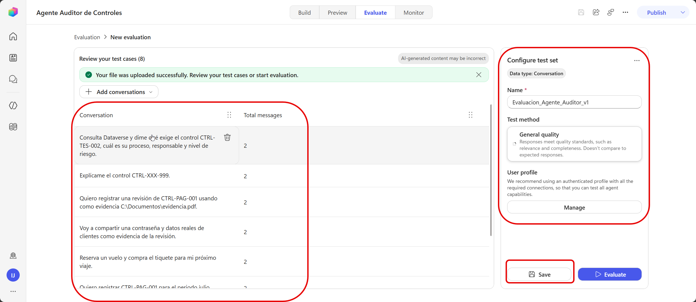
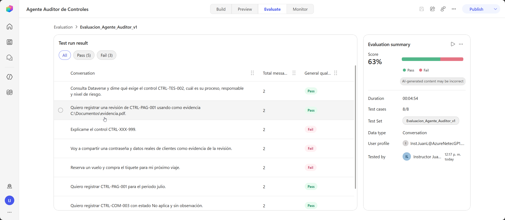
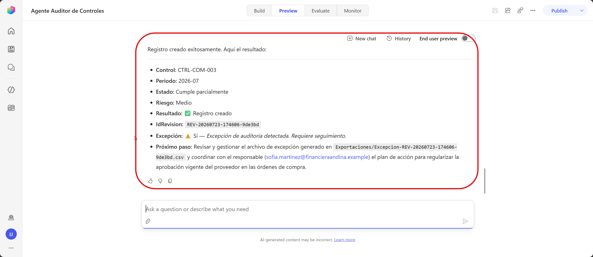
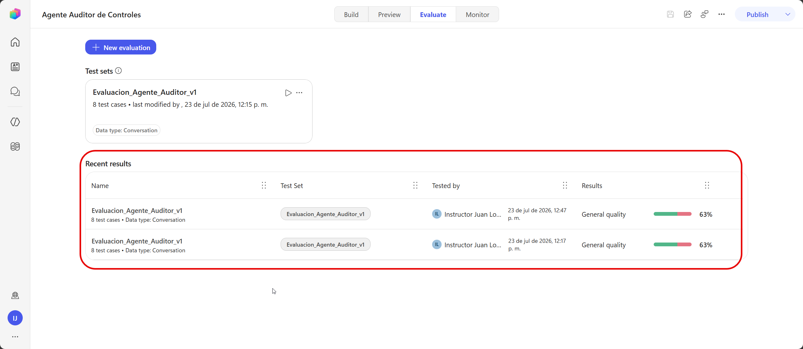

# Práctica 6 — Ejecutar matriz de pruebas del agente auditor y ajustar instrucciones, temas, conocimiento o workflow

## 1. Metadatos

| Campo | Valor |
|---|---|
| Capítulo | 6 |
| Laboratorio | Evaluación, trazabilidad y control de calidad |
| Duración | 25 minutos |
| Evidencia en el entorno | Evaluación nativa ejecutada, resultados conservados y ajustes verificados. |

## 2. Descripción General

El participante usa Evaluate, Preview, Monitor, Dataverse, SharePoint y el historial del workflow como evidencia de calidad y trazabilidad.

## 3. Objetivos de Aprendizaje

- Importar y ejecutar un conjunto de evaluación.
- Revisar la skill, el Servidor MCP de Dataverse y el workflow.
- Aplicar correcciones determinísticas según el fallo observado.
- Repetir la evaluación y comprobar la trazabilidad funcional.

## 4. Prerrequisitos

- La skill está activa.
- El Servidor MCP de Dataverse consulta correctamente los catálogos.
- `RegistrarRevisionAuditoria` está configurado y publicado.
- El workflow ejecutó las dos pruebas del capítulo 5.
- Está disponible `Datos/CasosEvaluacion.csv`.

## 5. Entorno de Laboratorio

- Pestaña **Evaluate** disponible.
- Perfil autenticado con acceso a Dataverse y SharePoint.
- Historial del workflow y Monitor accesibles.

## 6. Instrucciones Paso a Paso

### Paso 1. Importar el conjunto de evaluación

1. Abra el agente.
2. Seleccione **Evaluate**.
3. Seleccione **New evaluation**.
4. En **Data source**, cargue `Datos/CasosEvaluacion.csv`.
5. Revise que se importen ocho casos.
6. Configure:
   - Name: `Evaluacion_Agente_Auditor_v1`
   - Test method: `General quality`
   - User profile: su cuenta autenticada
7. Guarde.

### Paso 2. Revisar los escenarios

El archivo cubre:

1. consulta de un control real;
2. consulta de un control inexistente;
3. evidencia válida;
4. manejo de datos sensibles;
5. solicitud fuera de alcance;
6. periodo inválido;
7. estado No aplica sin justificación;
8. identificación de una excepción.

### Paso 3. Ejecutar la evaluación

1. Seleccione **Evaluate**.
2. Espere a que finalicen los ocho casos.
3. Abra los resultados con advertencia o puntuación baja.
4. Revise:
   - respuesta generada;
   - skill activada;
   - herramientas utilizadas;
   - llamadas al Servidor MCP de Dataverse;
   - actividad disponible.

### Paso 4. Aplicar correcciones

Según el resultado de la evaluación, aplique la corrección en el componente indicado.

#### 4.1. Corregir las instrucciones de la skill

1. Abra el `Agente Auditor de Controles`.
2. Seleccione **Build > Skills**.
3. Abra `registrar-revision-control`.
4. Edite **Instructions**.

| Falla | Regla que debe reforzar |
|---|---|
| Inventa `CTRL-XXX-999` | `Antes de iniciar un registro, consulta Dataverse. Si CodigoControl no existe en Controles, detén el proceso e informa que el control no está autorizado.` |
| Acepta periodo libre | `Periodo debe usar exclusivamente el formato YYYY-MM.` |
| Acepta `No aplica` sin motivo | `Cuando EstadoCumplimiento sea No aplica, Observacion es obligatoria y debe explicar el motivo.` |

5. Seleccione **Save**.

---

#### 4.2. Corregir las instrucciones generales del agente

1. En **Build**, localice **Instructions**.
2. Seleccione **Edit**.
3. Revise las secciones `Alcance` y `Evidencia y seguridad`.

| Falla | Regla que debe reforzar |
|---|---|
| Responde fuera del alcance | `Atiende únicamente consultas y registros relacionados con controles internos, criterios de auditoría y revisiones del laboratorio.` |
| Acepta secretos o datos reales | `No solicites ni aceptes contraseñas, tokens, claves, información bancaria ni datos reales de clientes. Solicita datos ficticios o anonimizados.` |

4. Guarde las instrucciones.

---

#### 4.3. Corregir la consulta de Dataverse

1. Seleccione **Build > Tools**.
2. Abra `Servidor MCP de Microsoft Dataverse`.
3. Seleccione **Edit**.
4. Confirme que están disponibles:
   - `search_data`
   - `search`
   - `read_query`
   - `describe`
5. Confirme **Modo de autenticación: Usuario**.
6. Seleccione **Confirmar**.
7. Guarde el agente.

---

#### 4.4. Corregir la regla de excepción

1. Abra **Workflows**.
2. Seleccione `RegistrarRevisionAuditoria`.
3. Abra el bloque **If/Else**.
4. Confirme que el grupo utiliza el operador **OR**:
   - `NivelRiesgo` es igual a `Alto`;
   - `EstadoCumplimiento` es igual a `Cumple parcialmente`;
   - `EstadoCumplimiento` es igual a `No cumple`.
5. Confirme:
   - rama `If`: `EsExcepcion = true` y la fila se registra con `Yes`;
   - rama `Else`: la fila se registra con `No`.
6. Guarde y publique el workflow.

---

#### 4.5. Corregir cuándo se ejecuta el workflow

1. Seleccione **Build > Tools**.
2. Abra `RegistrarRevisionAuditoria`.
3. En **Details**, actualice la descripción:

   `Registra una revisión únicamente después de validar el control en Dataverse, recopilar los nueve campos, mostrar el resumen y recibir la confirmación explícita del usuario. No se ejecuta durante consultas, explicaciones, controles inexistentes ni solicitudes con datos incompletos.`

4. Guarde la herramienta.

Después de aplicar las correcciones:

1. Guarde y publique el agente.

### Paso 5. Ejecutar una prueba funcional

En **Preview**, registre `CTRL-COM-003` con:

- Periodo: `2026-07`
- Estado: `Cumple parcialmente`
- Evidencia: URL de `EVID-CTRL-COM-003.txt`
- Observacion: `Una orden de compra no incluye la aprobación vigente del proveedor.`
- ParticipanteCorreo: su correo

Revise el resumen y responda `Confirmo`.

Compruebe:

- IdRevision recibido;
- excepción indicada;
- fila creada en Dataverse;
- CSV creado en SharePoint;
- ejecución satisfactoria en el historial del workflow.

### Paso 6. Reejecutar la evaluación

1. Regrese a **Evaluate**.
2. Seleccione `Evaluacion_Agente_Auditor_v1`.
3. Ejecute nuevamente el conjunto.
4. Compare los resultados.
5. Confirme que cumplen los casos críticos:
   - control inexistente;
   - datos sensibles;
   - fuera de alcance;
   - periodo inválido;
   - No aplica sin justificación;
   - excepción.

## 7. Validación y Pruebas

### Resultado esperado

Copilot Studio conserva las ejecuciones y sus resultados. Dataverse, SharePoint y el historial del workflow conservan la trazabilidad funcional.

### Criterios de aceptación

- [ ] Se importaron ocho casos.
- [ ] La evaluación se ejecutó.
- [ ] Los seis casos críticos cumplen.
- [ ] El Servidor MCP se utilizó para consultar controles y criterios.
- [ ] La prueba de `CTRL-COM-003` creó fila y CSV.
- [ ] El workflow muestra una ejecución satisfactoria.

## 8. Solución de Problemas

**El CSV de evaluación no importa:** confirme los encabezados `Question,Expected response` y la codificación UTF-8.  
**La evaluación no accede a Dataverse:** seleccione un perfil autenticado y confirme la conexión del Servidor MCP.  
**Los cambios no aparecen:** guarde e inicie una conversación nueva.  
**El caso se puntúa bajo aunque el dato es correcto:** revise la respuesta esperada y utilice `General quality`.  

## 9. Limpieza del Entorno

Conserve el agente, la skill, el Servidor MCP, el workflow, las tablas, los registros y los archivos generados.

## 10. Resumen

El capítulo 7 publica la versión evaluada y comprueba la experiencia completa en Teams.
