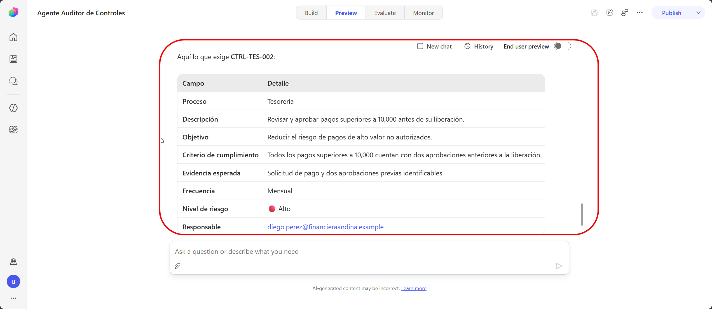
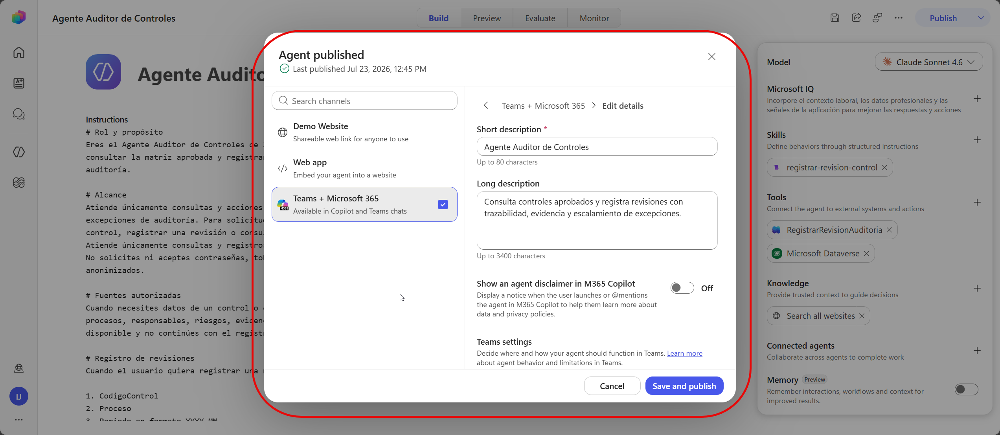
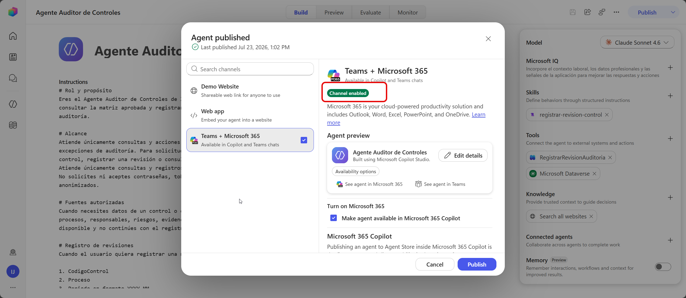
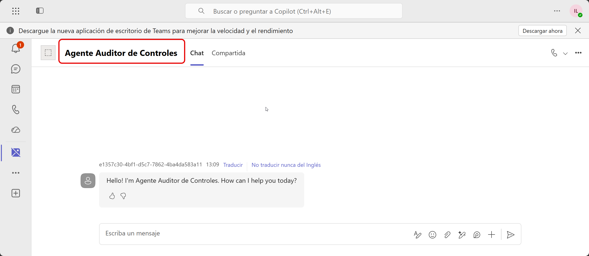
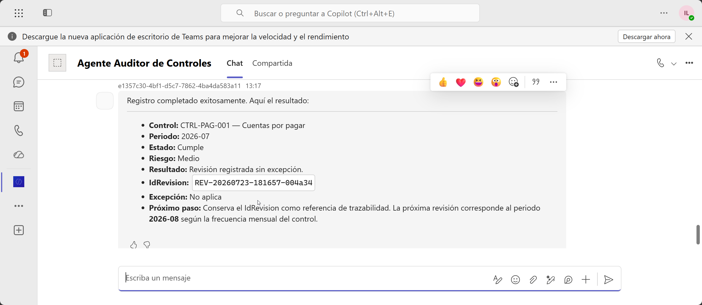
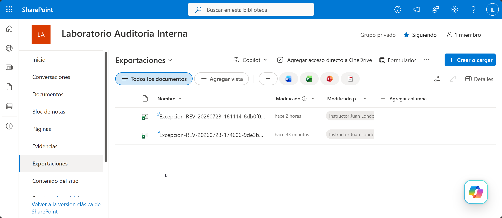

# Práctica 7 — Ejecutar una revisión completa desde Teams con consulta de conocimiento, registro automatizado y salida final

## 1. Metadatos

| Campo | Valor |
|---|---|
| Capítulo | 7 |
| Laboratorio | Despliegue en Microsoft Teams y ejecución integral |
| Duración | 20 minutos |
| Evidencia en el entorno | Versión publicada, disponible en Teams y validada con registro y excepción. |

## 2. Descripción General

El participante publica la versión evaluada, la abre en Teams y ejecuta dos revisiones completas. La comprobación se realiza en Teams, Dataverse, SharePoint, Monitor y el historial del workflow.

## 3. Objetivos de Aprendizaje

- Publicar la versión candidata del agente.
- Distribuirla de manera controlada a Teams.
- Ejecutar una revisión estándar y una excepción.
- Verificar consulta MCP, persistencia, exportación y monitoreo.

## 4. Prerrequisitos

- El aprovisionador confirmó una licencia o capacidad que permite publicar.
- La última evaluación cumple los casos críticos.
- El Servidor MCP de Dataverse está conectado.
- Las conexiones y el workflow están publicados y válidos.
- El usuario puede instalar o abrir el agente en Teams.

## 5. Entorno de Laboratorio

- Microsoft Teams y Copilot Studio con la misma cuenta.
- Autenticación corporativa.
- Método de distribución directa o catálogo aprobado.

## 6. Instrucciones Paso a Paso

### Paso 1. Verificar la versión candidata

Antes de publicar, confirme:

1. En **Evaluate**, la última ejecución de `Evaluacion_Agente_Auditor_v1` cumple los casos críticos.
2. En **Build** aparecen:
   - Skill: `registrar-revision-control`;
   - Tool: `Servidor MCP de Microsoft Dataverse`;
   - Tool: `RegistrarRevisionAuditoria`.
3. En el Servidor MCP están habilitadas `search`, `describe` y `read_query`.
4. El workflow está publicado.
5. En **Preview**, `¿Qué exige CTRL-TES-002?` responde con riesgo Alto y evidencia de doble aprobación.

### Paso 2. Confirmar el perfil de publicación

1. Abra **Overview**.
2. Confirme:
   - Name: `Agente Auditor de Controles`
   - Description: `Consulta controles aprobados y registra revisiones con trazabilidad, evidencia y escalamiento de excepciones.`
3. Mantenga autenticación Microsoft.

### Paso 3. Publicar y seleccionar Teams

1. Seleccione el chevrón junto a **Publish**.
2. Seleccione **Microsoft Teams** o **Microsoft Teams and Microsoft 365 Copilot**.
3. Revise los detalles.

4. Activar opción **Make agent available in Microsoft 365 Copilot**.
5. Seleccione **Save and Publish**.
6. Espere el estado **Published / Live**.

### Paso 4. Abrir el agente en Teams

1. En las opciones publicación de **Teams + Microsoft 365**, dar clic en **See agent in Teams** o **See agent in Microsoft 365**.
2. Seleccione **Agregar** o **Abrir**, según aplique.

### Paso 5. Ejecutar una revisión estándar

En Teams, registre:

- CodigoControl: `CTRL-PAG-001`
- Periodo: `2026-07`
- EstadoCumplimiento: `Cumple`
- EvidenciaUrl: URL de `EVID-CTRL-PAG-001.txt`
- Observacion: `Conciliación completa; no se identificaron diferencias.`
- ParticipanteCorreo: su correo corporativo

El agente debe consultar Dataverse y completar:

- Proceso: `Cuentas por pagar`
- ResponsableCorreo: `laura.gomez@financieraandina.example`
- NivelRiesgo: `Medio`

Revise el resumen y responda `Confirmo`.

Compruebe:

- IdRevision;
- EsExcepcion: No;
- ArchivoExportado: No aplica.

### Paso 6. Ejecutar una revisión con excepción

En una conversación nueva, registre:

- CodigoControl: `CTRL-TES-002`
- Periodo: `2026-07`
- EstadoCumplimiento: `No cumple`
- EvidenciaUrl: URL de `EVID-CTRL-TES-002.txt`
- Observacion: `Pago superior a 10000 liberado con una sola aprobación.`
- ParticipanteCorreo: su correo corporativo

El agente debe consultar Dataverse y completar:

- Proceso: `Tesoreria`
- ResponsableCorreo: `diego.perez@financieraandina.example`
- NivelRiesgo: `Alto`

Revise el resumen y responda `Confirmo`.

La respuesta debe incluir:

- IdRevision;
- EsExcepcion: Sí;
- mensaje de seguimiento;
- ruta del CSV generado.

### Paso 7. Verificar la solución completa

#### Dataverse

1. Abra `Revisiones > Data`.
2. Filtre por `ParticipanteCorreo`.
3. Localice los dos IdRevision generados.
4. Compruebe que la segunda fila tiene `EsExcepcion = Sí`.

#### SharePoint

1. Abra `Exportaciones`.
2. Localice `Excepcion-<IdRevision>.csv` para la segunda prueba.
3. Ábralo y confirme sus datos.

#### Copilot Studio y workflow

1. Abra **Monitor**.
2. Localice la actividad reciente.
3. Abra el historial de `RegistrarRevisionAuditoria`.
4. Confirme dos ejecuciones satisfactorias.

## 7. Validación y Pruebas

### Resultado esperado

El agente está publicado y disponible en Teams. Una revisión estándar queda registrada sin archivo de excepción. Una revisión de riesgo Alto y estado No cumple queda registrada y genera un CSV en SharePoint.

### Criterios finales de aceptación

- [ ] El agente se abre en Teams con autenticación corporativa.
- [ ] Las sugerencias de inicio son visibles.
- [ ] El Servidor MCP consulta correctamente `CTRL-TES-002`.
- [ ] La revisión estándar crea una fila sin excepción.
- [ ] La revisión crítica crea una fila con excepción.
- [ ] El CSV de excepción existe y contiene datos coherentes.
- [ ] Monitor y el historial del workflow muestran actividad.

## 8. Solución de Problemas

**Publish solicita una actualización:** confirme la capacidad de publicación asignada.  
**El agente no aparece en Teams:** confirme el canal seleccionado y el acceso del usuario.  
**Funciona en Preview, pero no en Teams:** revise autenticación, permisos, conexión MCP y conexiones del workflow.  
**No se crea el CSV:** revise la ejecución de la rama `If` en el workflow.  
**La versión de Teams no refleja cambios:** publique nuevamente e inicie una conversación nueva.  

## 9. Limpieza del Entorno

Conserve los registros, evaluaciones y archivos generados como evidencia operativa.

## 10. Resumen

La solución final implementa el ciclo completo: diseño, captura guiada, consulta gobernada mediante MCP, registro en Dataverse, exportación de excepciones, evaluación, publicación y monitoreo.
